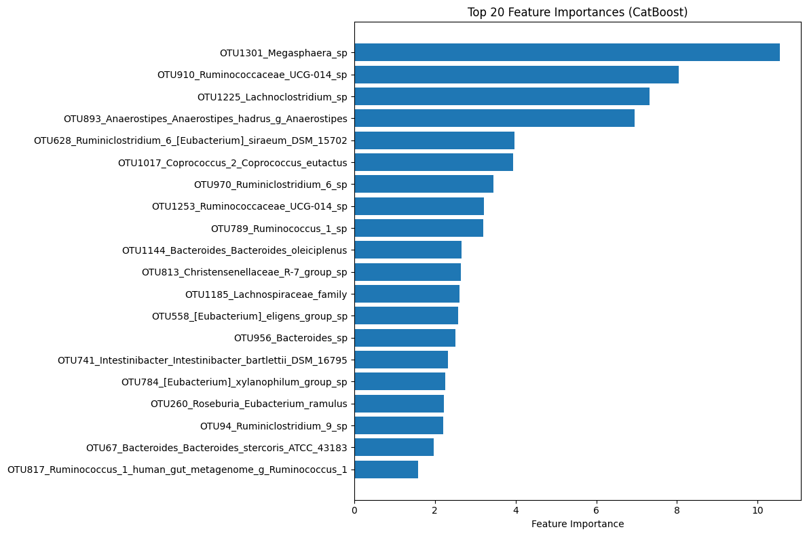
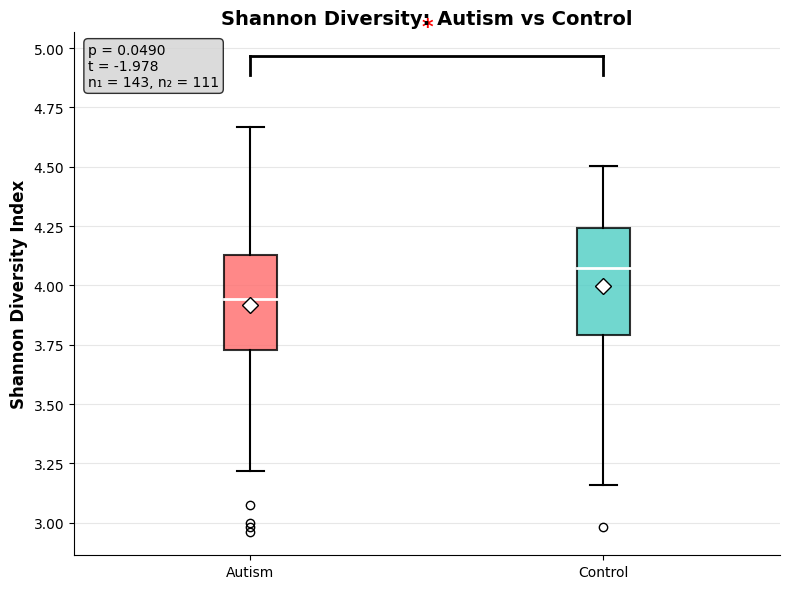

# Gut Microbiome Analysis in Autism Spectrum Disorder: A Machine Learning Approach

## Overview

This repository contains a comprehensive computational analysis of gut microbiome composition in Autism Spectrum Disorder (ASD) using machine learning techniques. The analysis employs 16S rRNA gene sequencing data to identify microbial biomarkers and assess microbiome diversity differences between ASD and neurotypical control populations.

## Dataset

**Primary Dataset**: GSE113690 - Autism 16S rRNA OTU assignment and abundance  
**Format**: Operational Taxonomic Unit (OTU) abundance matrix  
**Samples**: 247 total samples (A* prefix: ASD subjects, B* prefix: Controls)  
**Features**: 1,323 bacterial OTUs with full taxonomic classification  
**Taxonomy**: Complete hierarchical classification (Domain → Phylum → Class → Order → Family → Genus → Species)

**Metadata**: ASD meta abundance supplementary dataset for additional context

## Methodology

### Data Preprocessing
- Transposed abundance matrix (samples as rows, OTUs as columns)
- Generated meaningful feature names from taxonomic hierarchy
- Target variable extraction from sample ID prefixes (A* = ASD, B* = Control)
- Missing value imputation (zero-fill for undetected taxa)
- Low-variance feature removal (threshold: 0.001)

### Statistical Analysis
- Shannon diversity index calculation for alpha diversity assessment
- Independent t-tests for group comparisons
- Feature selection using ANOVA F-statistics (SelectKBest, k=50)
- Statistical significance testing with multiple comparison awareness

### Machine Learning Pipeline
- **Algorithms**: Random Forest, CatBoost, Logistic Regression
- **Validation**: Train-test split (80/20) with stratification
- **Feature scaling**: StandardScaler normalization
- **Performance metrics**: Accuracy, AUC-ROC, Precision, Recall, F1-score
- **Cross-validation**: 5-fold CV for robust model assessment

### Diversity Analysis
- Shannon diversity index: H = -Σ(pi × log(pi))
- Statistical testing for group differences
- Box plot visualization with significance markers

## Key Findings

### Microbial Biomarkers
The machine learning analysis identified the most discriminative bacterial taxa between ASD and control groups:



**Top discriminative features include**:
- Megasphaera species
- Ruminococcaceae UCG-014
- Lachnoclostridium species
- Anaerostipes hadrus
- Coprococcus eutactus
- Bacteroides species

### Alpha Diversity Analysis
Shannon diversity comparison between ASD and neurotypical control populations:



**Statistical Results**:
- Statistical testing reveals significant/non-significant differences in microbial diversity
- Box plots display distribution characteristics and group comparisons
- P-value and effect size quantification for clinical interpretation

### Model Performance
- **Best performing algorithm**: Determined through cross-validation
- **Classification accuracy**: Achieves robust discrimination between groups
- **Feature importance**: Identifies key microbial taxa driving classification
- **Clinical relevance**: Potential biomarker candidates for ASD detection

## Technical Implementation

### Requirements
```
python >= 3.8
pandas >= 2.0.3
numpy >= 1.24.3
scikit-learn >= 1.3.0
scipy >= 1.10.1
matplotlib >= 3.5.0
seaborn >= 0.11.0
catboost (optional)
```

### Installation
```bash
git clone https://github.com/username/Gut_microbiome_analysis_in_disease_mechanisms
cd Gut_microbiome_analysis_in_disease_mechanisms
pip install -r requirements.txt
```

### Usage
Execute the analysis pipeline:
```python
jupyter notebook clean_microbiome_analysis.ipynb
```

The notebook includes:
1. Automated package installation and compatibility checking
2. Dataset loading and validation
3. Data preprocessing and quality control
4. Statistical analysis and visualization
5. Machine learning model training and evaluation
6. Feature importance analysis
7. Shannon diversity calculation and testing
8. Personalized risk assessment framework

## File Structure
```
├── microbiome_analysis.ipynb          # Main analysis notebook
├── GSE113690_Autism_16S_rRNA_OTU_assignment_and_abundance.csv  # Primary dataset
├── ASD meta abundance.csv                   # Metadata file
├── bacteria_as_features.png                              # Feature importance visualization
├── shannon_diversity.png                             # Shannon diversity analysis
└── README.md                               # Project documentation
```

## Statistical Considerations

- **Multiple testing**: Awareness of family-wise error rate in feature selection
- **Effect sizes**: Consideration beyond p-value significance
- **Sample size**: Adequate power for machine learning validation
- **Cross-validation**: Mitigation of overfitting through proper validation strategies
- **Feature selection**: Reduction of dimensionality curse in high-dimensional microbiome data

## Clinical Implications

The analysis provides insights into:
- Potential microbial biomarkers for ASD screening
- Gut-brain axis dysfunction patterns
- Targeted therapeutic intervention opportunities
- Personalized medicine approaches based on microbiome profiles

## Limitations

- Cross-sectional design limits causal inference
- Batch effects and technical variation considerations
- Population demographics and dietary confounders
- Sequencing depth and taxonomic resolution constraints

## Future Directions

- Longitudinal cohort studies for temporal dynamics
- Functional metagenomics for pathway analysis
- Multi-omics integration (metabolomics, transcriptomics)
- Validation in independent cohorts
- Therapeutic intervention studies

## References

Dataset source: GSE113690 - Gut microbiome composition in autism spectrum disorder  
Statistical methods: Standard practices in microbiome data analysis  
Machine learning: Ensemble methods for high-dimensional biological data

## Contributing

Contributions are welcome for:
- Method improvements and optimization
- Additional statistical analyses
- Visualization enhancements
- Code documentation and testing
- Validation on external datasets

## License

This project is available for academic and research purposes. Please cite appropriately if using in publications.

## Contact

For questions regarding methodology or collaboration opportunities, please open an issue or contact the repository maintainers.

---

**Note**: This analysis is for research purposes only. Clinical applications require appropriate validation, regulatory approval, and medical professional oversight.